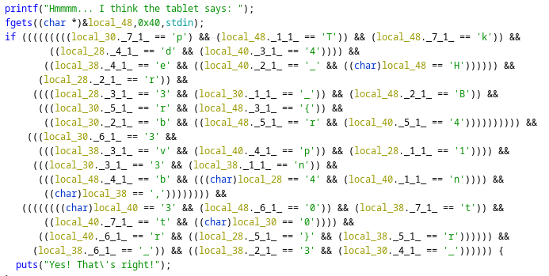

1. Open the file in Ghidra
2. In defined strings find "Yes! That's right!" and follow the XREF
3. All the characters are here, all we have to do is put them in order



4. Take a lot of time to do by hand, to be a bit faster first thing to do right click on local_48 (variable pointing to the flag) then select **"Retype Variable"** and select **uchar[48]**
5. Then copy paste the whole comparison code, delete all '(' and ')' also delete all space and line feed, replace all '&&' by ':' and, finally, replace '[' and ']' by **'**
6. The result of the 5 is a python dictionnaries with the index of the letter as key, we just have to iterate through this dictionnary to get the flag

``` python
my_dict = {'34':'4','20':'3','36':'r','1':'T','21':'v','6':'0','39':'}','38':'d','31':'r','29':'3','8':'3','22':'e','35':'1','5':'r','0':'H','32':'3','18':'.','13':'4','3':'{','10':'_','16':'.','4':'b','7':'k','15':'t','14':'r','19':'n','25':'t','17':'.','9':'n','30':'_','26':'0','24':'_','12':'p','23':'r','28':'b','33':'p','2':'B','27':'_','11':'4','37':'3'}

flag = ''

for i in range(40):
    flag += my_dict(str(i))

print (flag)
```

7. It's not necessary to replace '[' and ']' by single quotes ! Without the single quotes then the keys are int and we don't have to cast to str in the for loop